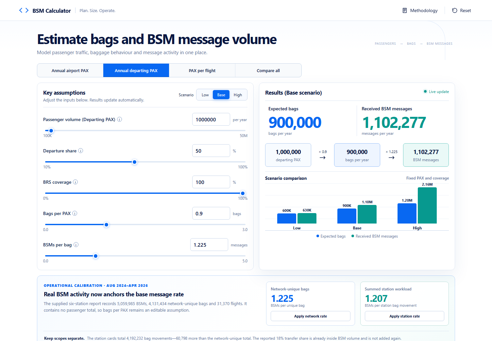

# BSM Volume Calculator

[](https://github.com/burakdagdeviren/BSM_Calculator/actions/workflows/deploy-pages.yml)

An interactive planning tool for estimating checked baggage volume, inbound Baggage Source Message (BSM) traffic, and indicative peak processing demand for a Baggage Reconciliation System (BRS).

**Live calculator:** [burakdagdeviren.github.io/BSM_Calculator](https://burakdagdeviren.github.io/BSM_Calculator/)



## What the calculator does

The calculator follows an explainable flow:

> Passenger traffic → passengers within BRS scope → checked bags → received BSM messages

It keeps physical bags and message envelopes as separate quantities. This matters because a single BSM can reference multiple bags, while changes, deletions, reissues, and delivery repeats can create additional message traffic.

The primary calculation is:

```text
Expected bags = PAX × departure share × BRS coverage × bags per PAX

Expected BSMs = Expected bags × received BSMs per bag + extra messages
```

## Features

- **Three passenger input bases:** annual airport passengers, annual departing passengers, or passengers per flight.
- **Independent comparison mode:** compare all three input bases without double-counting or summing overlapping traffic.
- **Low, base, and high scenarios:** quickly explore the sensitivity of bag and message rates.
- **Operational reference:** apply either the network-unique or summed station-workload rate derived from the supplied six-station BSM report.
- **Live calculations:** sliders and exact numerical inputs update results immediately.
- **Baggage behaviour model:** derive bags per passenger from checked-bag participation, bags per checking passenger, and an optional gate-bag increment.
- **Message activity model:** decompose BSM traffic into initial grouped messages, CHG, DEL, reissue, and repeat-delivery components.
- **Peak-capacity planning:** estimate design-day, peak-hour, burst, outage-recovery, and headroom requirements.
- **Transparent methodology:** the built-in explanation describes boundaries and prevents incompatible assumptions from being applied twice.
- **Responsive interface:** designed for desktop, tablet, and mobile browsers.

## Input modes

| Mode | Passenger interpretation | Conversion to departing PAX |
|---|---|---|
| Annual airport PAX | Total airport passengers, normally arrivals plus departures | `PAX × departure share` |
| Annual departing PAX | Passengers boarding departing flights | No conversion |
| PAX per flight | Expected or actual passengers on one departing flight | No conversion |
| Compare all | Three independent scenarios shown together | Each row keeps its own scope |

The comparison rows are alternatives. They are deliberately not added together.

## Operational calibration added in v1.1

The supplied Aug 2024–Apr 2026 usage report provides a real message-to-bag calibration across six stations:

| Measure | Reported or derived value |
|---|---:|
| Flights | 31,370 |
| Network-unique bags | 4,131,434 |
| Summed station bag movements | 4,192,232 |
| Received BSMs | 5,059,985 |
| Transfer share of BSM volume | 18% |
| BSMs per network-unique bag | **1.22475** |
| BSMs per station bag movement | **1.20699** |
| BSMs per flight | 161.30 |

The station BSM totals add exactly to the reported network BSM total. The station bag cards add to 4,192,232, which is 60,798 above the network-unique bag headline. The calculator therefore exposes both valid denominators instead of silently mixing them:

- Use **1.225** when the modeled bag count is deduplicated across the network in the same way as the report's unique-bag headline.
- Use **1.207** when the modeled bag count represents the sum of bag movements handled by individual stations.

The report does not include passenger totals, so it cannot calibrate bags per PAX. The 18% transfer share is descriptive and already included in total BSM volume; it is not applied as an extra multiplier.

## Default scenario assumptions

The included assumptions are editable planning scenarios rather than claimed industry averages.

| Scenario | Bags per PAX | Received BSMs per bag | BSMs per 1,000,000 served departing PAX |
|---|---:|---:|---:|
| Low | 0.60 | 1.05 | 630,000 |
| Base | 0.90 | 1.22475 | 1,102,277 |
| High | 1.20 | 1.80 | 2,160,000 |

For the base case, 1,000,000 served departing passengers produce an expected 900,000 bags and approximately 1,102,277 received BSM messages. The 0.90 bags/PAX value remains an adjustable planning assumption; only the base BSM-per-bag coefficient is calibrated to the supplied report.

## Advanced formulas

### Baggage behaviour

```text
Bags per PAX = checked-bag participation × bags per checking passenger
             + gate-bag increment
```

The gate-bag increment should only be used when gate-checked baggage is excluded from the other two inputs.

### Message activity

```text
Distinct BSMs per bag = 1 / bags per initial BSM
                      + CHG envelopes per bag
                      + DEL envelopes per bag
                      + reissue envelopes per bag

Received BSMs per bag = distinct BSMs per bag × (1 + repeat-delivery ratio)
```

This permits values below one BSM envelope per bag when initial messages contain several bag references.

### Peak processing estimate

```text
Average day  = annual BSMs / operating days
Design day   = average day × busy-day factor
Peak hour    = design day × peak-hour share
Peak rate    = peak hour / 3,600 × burst factor
Design rate  = (peak rate + backlog / recovery seconds) × (1 + headroom)
```

Annual passenger volume alone cannot establish peak system throughput. Local timing distributions and disruption/replay traffic should be used for production sizing.

## Local development

Requirements:

- Node.js 22 or newer
- npm

```bash
git clone https://github.com/burakdagdeviren/BSM_Calculator.git
cd BSM_Calculator
npm install
npm run dev
```

Vite prints the local browser address after startup.

## Validation and production build

```bash
npm test
npm run build
```

The automated tests cover:

- The documented 900,000-bag and 1,170,000-message example.
- Reproduction of the supplied 5,059,985-message total from its network-unique-bag rate.
- Separation of 4,131,434 network-unique bags from 4,192,232 summed station bag movements.
- Equivalence between converted airport PAX and departing PAX.
- Direct and decomposed coefficient calculations.
- Multi-bag initial BSM grouping.
- Peak-rate calculations with backlog recovery and headroom.

The production output is written to `dist/`.

## GitHub Pages deployment

The workflow in `.github/workflows/deploy-pages.yml` runs the mathematical tests, creates the production build, and publishes `dist/` to GitHub Pages whenever `main` changes. The Vite build uses relative asset paths so the calculator works beneath the `/BSM_Calculator/` repository path.

If Pages is not already configured, open **Repository settings → Pages** and select **GitHub Actions** as the source. The workflow will then publish the live URL shown near the top of this README.

## Calibration guidance

For operational sizing, replace the example assumptions with aligned local data covering the same airport, airline scope, flight dates, direction, and BRS interface boundary. Recommended calibration ratios are:

```text
bags per PAX = actual in-scope bags / served departing PAX
BSMs per bag = received BSM envelopes / actual in-scope bags
```

Use ratios of totals rather than an unweighted average of flight-level ratios. Retain receipt timestamps to analyze rolling one-second, one-minute, and five-minute peaks.

For multiple stations, select the denominator that matches the workload boundary. Network-unique bags and the sum of station bag movements can differ when the same bag is represented at more than one processing boundary.

## Research basis and limitations

The full mathematical study is available in [BSM_Estimation_Study_and_Tool_Plan.md](BSM_Estimation_Study_and_Tool_Plan.md). It records the counting boundaries, formulas, worked examples, calibration method, uncertainty treatment, source references, and acceptance cases used to create this calculator.

The outputs are planning estimates. They depend on local airline mix, transfer share, baggage behaviour, message grouping, DCS update behaviour, interface routing, duplicate delivery, and disruption patterns. They do not certify compliance with IATA Recommended Practice 1745 or replace measurement of the production message feed.

## Technology

- React
- Vite
- CSS and inline SVG for the interface and charts
- Node.js built-in test runner
- GitHub Actions and GitHub Pages

No backend, database, API key, analytics service, or personal passenger data is required. All calculations run locally in the browser.
